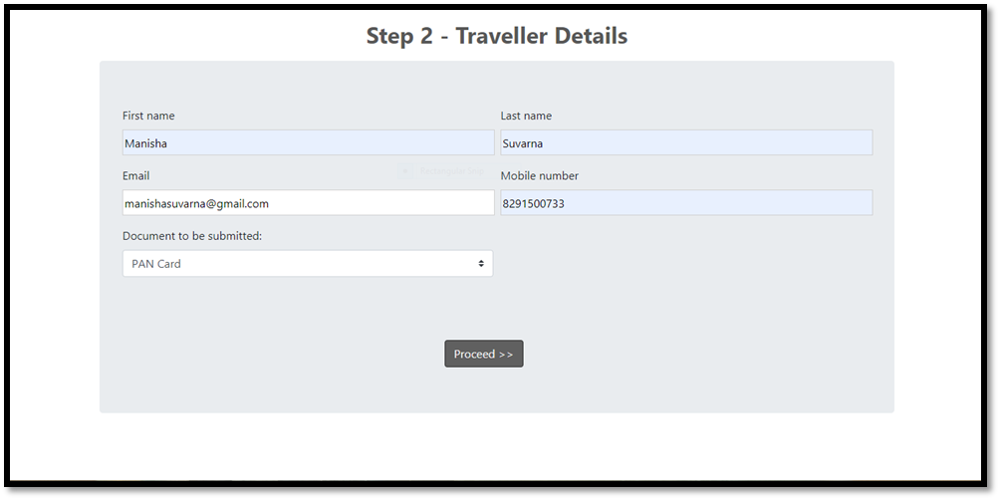
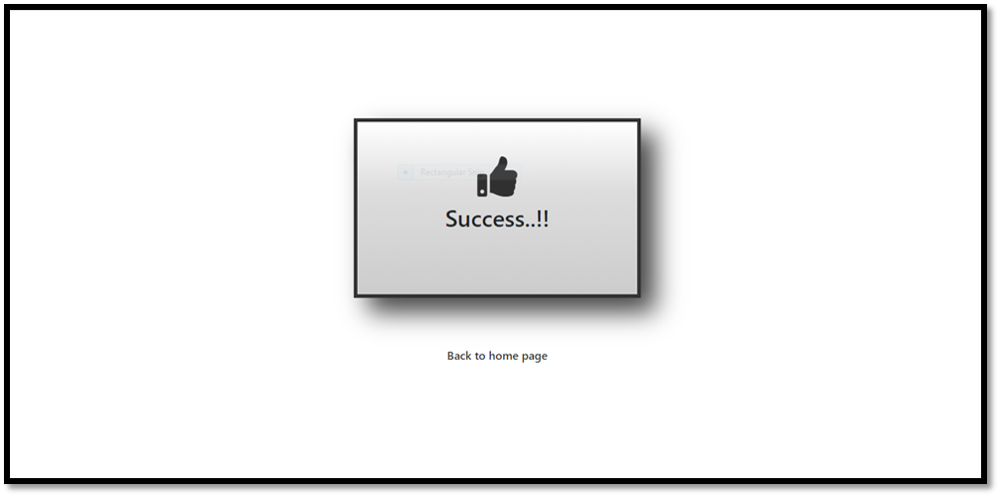

# Hotel-Management-System
A website for an enterprise, having a chain of hotels in multiple countries or a specific nation. 

**Overview:**
The website contains the details about the various branches located in mega cities. It also includes a brief information about the hotel, facilities provided, its location, ratings, contact details, location and a lot more.
It is acting as a common portal for booking of rooms across the hotels, in a much easier and hassle free manner. It gives users a glimpse of the probable experience when visited.
The website is also a platform for the regular customers to express their satisfaction and suggest constructive feedbacks, if any. Any customers or new members seeking help can also connect to the support team using it as a medium.

The entire system is supported using a database (phpMyAdmin). The database has a collection of over 9-10 entities. They are person, customer, staff, testimonials, transaction, coupon, hotel, room type, room and enquiry. These entities and their relations are managed by a group of 18 relations (tables). Various DML commands like select, insert, update, delete and nested queries are used to achieve the desired output.
 
Thus, looking at the present rapidly growing market’s demand and requirement of people, it is acting as a connecting bridge between tourists, travelers and hotel management community.

**Working:**
Although the user can get access to few of the functions without having an account, but for most of the prime functions having a user account is mandated.

1.	Login/SignUp-
Login-
i.	Old customers, who have an account can use the facilities by simply using their email ID and password in the login section.
ii.	The entered pair of email ID and password is matched with the existing records in the database. If match is found then the user can proceed further.
iii.	In case of failure, then the user need to enter the credentials again.
iv.	Users are also provided with the forgot password option. On being clicked, it redirects user to security questions. Here, the user needs to enter the email ID and answer the basic questions like favourite book, favourite color and favourite tourist destination place. If answers are matched with the values, which the user has entered during sign up, it will allow the user to set up new password or else appropriate message will be displayed for re-entering the responses.

If user forgets the password, authentication is done using security questions.

SignUp-
i.	New customers, who don’t have an account can SignUp by clicking the register option on the login page.
ii.	Here, the user needs to enter the details like name, email ID, date of birth, gender, mobile number, password and address.
iii.	Besides this, the user also needs to answer few security questions, which would be used if the user forgets password in future. The security questions will have basic questions like- favourite book, favourite colour and favourite tourist destination place.
iv.	Submitting the above mentioned details will create a new user account.

2.	Booking a room-
The process of booking can be completed in three simple steps-
i.	Step-1 Selection of Room
a)	Selection of the city using the dropdown menu.
b)	Selecting the check-in and check-out dates.
c)	Selecting number of rooms (Only three rooms will be permitted per transaction).
d)	Selecting the room type, number of adults and number of children for the selected number of rooms ( a maximum of four people will be permitted per room).

ii.	Step-2  Traveller details-
a)	Here, the details of any one traveller whose ID proof is to be submitted should be entered.
b)	Details like name, email ID, mobile number are asked.
c)	The user needs to select any one type of ID proof to be submitted.

iii.	Step-3  Payment
a)	The total amount for the transaction is displayed on this page.
b)	The user needs to select the mode of payment.
c)	Card details must be entered and the booking must be confirmed.
           If all the steps are completed properly with appropriate credentials, the user will be                                     
           prompted with a confirmation.

3.	Registering for a membership-
i.	Three membership plans are provided to the user.
ii.	First scheme is free while the other two are paid ones. 
iii.	The user can register for any one of these schemes by simply clicking on the signup option.
iv.	It will redirect the user to payment page.
v.	After selecting the appropriate mode of payment and filling in the card details, the user can successfully signup for the membership.

4.	Making an enquiry request-
i.	This provision is available even for the new customers who don’t own an account.
ii.	On clicking on contact us or make a request button, the system redirects the user to enquiry page.
iii.	The user needs to enter very few details like name, email ID and phone number.
iv.	The user can drop a request as well (optional).
v.	Once done with this, the enquiry requested is successfully registered to be attended by a staff.

5.	Changing Password-
i.	There is also an additional provision to change the password.
ii.	The user needs to enter correct old password.
iii.	Enter the new password of choice.
iv.	Confirm the password by re-entering it.
v.	Message for successful updation of the password is displayed.

**Programming languages used:**
1. HTML
2. CSS
3. JavaScript
4. PHP
5. SQL

**Libraries used:**
1. Bootstrap
2. jQuery

**Website URL-**
https://hoteldeck.000webhostapp.com

